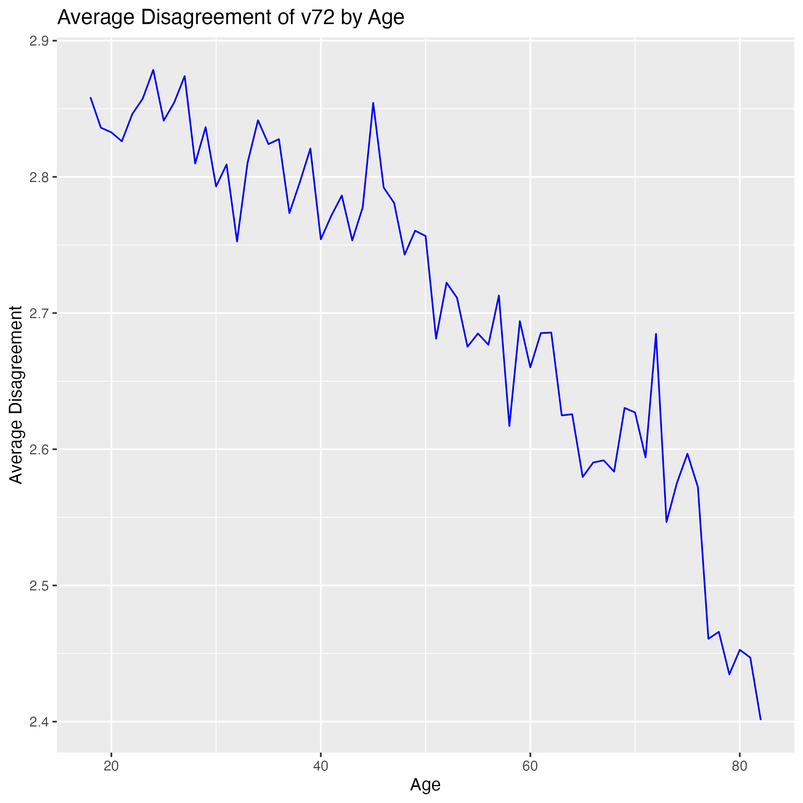
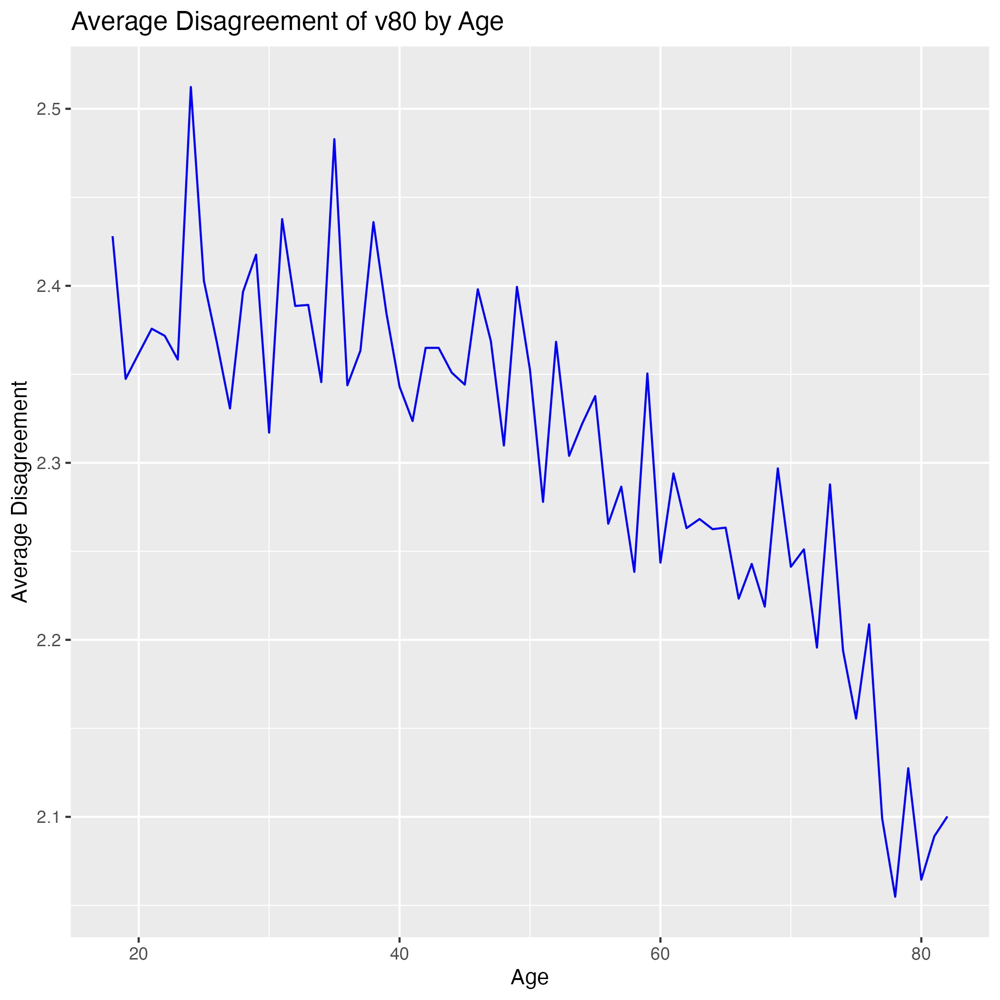

# Attitudes Towards Gender Roles and Immigration Analysis
## -Using data from European Value Study (EVS) 2017-


## Description

This project aims to analyze attitudes towards gender roles and immigration, Using data from [2017 European Value Study (EVS)](https://search.gesis.org/research_data/ZA7500). The data was downloaded on 27 March 2024.

Original datasets are data/ZA7500_v5-0-0.sav, and the cleaned data evs.rds was used for the reports. The variables that are used in this analysis are as below:

-   **v72** - Child suffers with working mother
    -   Question: When a mother works for pay, the children suffer
    -   Scale: 1 (Strongly agree) to 4 (Strongly disagree)
-   **v80** - Jobs are scarce:giving...(nation)priority
    -   Question: When jobs are scarce, employers should give priority to [Nationality] people over immigrants"
    -   Scale: 1 (Strongly agree) to 4 (Strongly disagree)
  
  
## Organization of the repo

This repository is organized as follows:

* **/data** - Contains both the raw data and edited data set used in the analysis as well as codebook of the EVS data set.
* **/scripts** - Contains master R script for data cleaning and analysis and markdown documents for two overall reports (one with code displayed and one without), and markdown documents for automated reports at the country level.
* **/overall_reports** - Contains an overall report with R code and another overall report without R code.
* **/country_reports** - Contains automated reports at the country level.
* **/figs** - Contains figures (charts, etc) generated during the analysis or any visual outputs produced.
* **/documentation** - Contains instructional document.


## Overview of findings from the analysis

The two graphs presented below illustrates how the two variables of interest change with age. Notably, the average disagreement towards both child suffers and job to national variables decreases as age increases. 


*Figure 1*


*Figure 2*


## Session info:

```
R version 4.3.1 (2023-06-16)
Platform: aarch64-apple-darwin20 (64-bit)
Running under: macOS Ventura 13.3

Matrix products: default
BLAS:   /System/Library/Frameworks/Accelerate.framework/Versions/A/Frameworks/vecLib.framework/Versions/A/libBLAS.dylib 
LAPACK: /Library/Frameworks/R.framework/Versions/4.3-arm64/Resources/lib/libRlapack.dylib;  LAPACK version 3.11.0

locale:
[1] en_US.UTF-8/en_US.UTF-8/en_US.UTF-8/C/en_US.UTF-8/en_US.UTF-8

time zone: America/New_York
tzcode source: internal

attached base packages:
[1] stats     graphics  grDevices utils     datasets  methods   base     

other attached packages:
 [1] broom_1.0.5        lubridate_1.9.3    forcats_1.0.0      stringr_1.5.0      purrr_1.0.2       
 [6] readr_2.1.4        tibble_3.2.1       tidyverse_2.0.0    plotly_4.10.4      texreg_1.39.3     
[11] ggExtra_0.10.1     summarytools_1.0.1 ggplot2_3.4.4      knitr_1.45         haven_2.5.3       
[16] tidyr_1.3.0        dplyr_1.1.3        sjlabelled_1.2.0  

loaded via a namespace (and not attached):
 [1] gtable_0.3.4      bslib_0.5.1       xfun_0.41         htmlwidgets_1.6.2 insight_0.19.6   
 [6] tzdb_0.4.0        crosstalk_1.2.0   vctrs_0.6.4       tools_4.3.1       generics_0.1.3   
[11] fansi_1.0.5       pkgconfig_2.0.3   data.table_1.14.8 checkmate_2.3.1   pryr_0.1.6       
[16] lifecycle_1.0.3   compiler_4.3.1    rapportools_1.1   munsell_0.5.0     codetools_0.2-19 
[21] httpuv_1.6.12     sass_0.4.7        htmltools_0.5.7   yaml_2.3.7        lazyeval_0.2.2   
[26] jquerylib_0.1.4   pillar_1.9.0      later_1.3.1       MASS_7.3-60       ellipsis_0.3.2   
[31] rsconnect_1.1.1   cachem_1.0.8      magick_2.8.3      mime_0.12         tidyselect_1.2.0 
[36] digest_0.6.33     stringi_1.7.12    reshape2_1.4.4    pander_0.6.5      labeling_0.4.3   
[41] fastmap_1.1.1     grid_4.3.1        colorspace_2.1-0  cli_3.6.1         magrittr_2.0.3   
[46] base64enc_0.1-3   utf8_1.2.4        withr_2.5.2       scales_1.2.1      promises_1.2.1   
[51] backports_1.4.1   timechange_0.2.0  rmarkdown_2.25    httr_1.4.7        matrixStats_1.2.0
[56] hms_1.1.3         evaluate_0.23     shiny_1.8.0       tcltk_4.3.1       viridisLite_0.4.2
[61] miniUI_0.1.1.1    rlang_1.1.1       Rcpp_1.0.11       xtable_1.8-4      glue_1.7.0       
[66] rstudioapi_0.15.0 jsonlite_1.8.7    R6_2.5.1          plyr_1.8.9      
```


